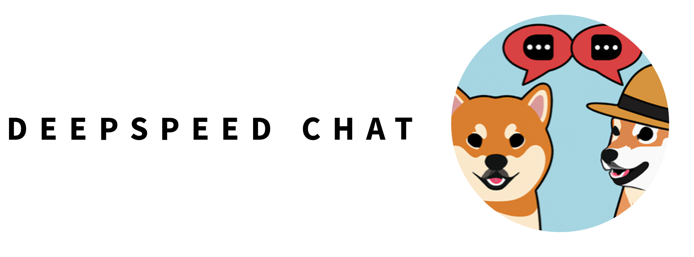

<p align="center">



</p>

<div align="center">

## DeepSpeed 分布式微调实战：大模型加速训练方案以及VLLM实现模型加速推理

</div>

## 🚀 介绍
本项目基于 LLaMA3.1-8B-Chinese 开源基座模型，所用的GPU是4块NVIDIA RTX A6000，聚焦医学问答任务，设计并实现了一套大模型领域化微调与部署流程。通过结合DeepSpeed分布式训练、LoRA微调、VLLM实现高并发推理在线服务端搭建、量化压缩、RAG 检索增强 等前沿技术，显著提升模型在专业医学问题上的回答准确率与专业度，同时大幅降低推理成本。因为这个是我在学习大模型时的项目，可能有一些问题，欢迎提issue，希望能对大家学习大模型有帮助。
## 🔥 基于DeepSpeed的LoRA微调

### 🐼 安装依赖
```bash
git clone https://github.com/RyanZxucheng/deepspeed-sft.git
cd DeepSpeed-SFT
pip install -r requirements.txt
```
如果服务器上无法连接huggingfacece，可以用清华镜像源
```bash
export HF_ENDPOINT=https://hf-mirror.com
```
## 🕐 Step 1 - 有监督微调（Supervised Fine-Tuning）
###  启动训练
```bash
cd training/supervised_finetuning/training_scripts/other_language
bash run_chinese.sh ./output  #./output这个参数可以自己的换成输出目录
```

## 🕐 Step 2 - 基于人类反馈强化学习（RLHF）
RLHF 是一种训练方法，用于让大语言模型（LLM）在生成内容时更符合人类期望。它结合了 强化学习（RL） 和 人类反馈（HF），不是单纯靠预测下一个词，而是让模型学会“什么是好的回答”。现有RLHF算法有：PPO，GRPO，DPO，我们这里用的是DPO。
###  启动训练
```bash
cd training/dpo_finetuning/training_scripts/llama3
bash run_llama3_7b_lora.sh ./output  #./output这个参数可以自己的换成输出目录
```

###  如何使用自己的数据集
除了示例脚本中使用的数据集之外，您还可以添加和使用自己的数据集。为此，首先需要在[dschat/utils/data/raw_datasets.py](https://github.com/RyanZxucheng/deepspeed-sft/blob/main/DeepSpeed-SFT/dschat/utils/data/raw_datasets.py) 中添加一个新类来定义使用数据时的格式。需要确保遵循在PromptRawDataset类中定义的api和格式，以确保DeepSpeed所依赖的数据格式一致。可以查看现有的类来了解如何做。

其次，需要在[dschat/utils/data/data_utils.py](https://github.com/RyanZxucheng/deepspeed-sft/blob/main/DeepSpeed-SFT/dschat/utils/data/data_utils.py)
中的get_raw_dataset函数中添加与新数据集对应的if条件。if条件中的dataset_name字符串应该是您将作为训练脚本参数提供的数据集名称。最后，需要修改训练脚本中的“--data_path”参数中。

###  测试

```
export CUDA_VISIBLE_DEVICES=0
python prompt_eval.py \
--model_name_or_path_baseline XXX \
--model_name_or_path_finetune XXX
```
分别改成你的基座模型和微调模型的路径,如果想要直接先测试一下模型效果，我已经将训练好的模型上传到[HuggingFace](https://huggingface.co/Ryyyyyyyan/Llama3.1-8B-Chinese-sft-medical)上，或者直接将--model_name_or_path_finetune参数改为Ryyyyyyyan/Llama3.1-8B-Chinese-sft-medical
```
export CUDA_VISIBLE_DEVICES=0
python prompt_eval.py \
--model_name_or_path_baseline XXX \
--model_name_or_path_finetune Ryyyyyyyan/Llama3.1-8B-Chinese-sft-medical
```
## 🔥 VLLM高并发推理服务
### 🚀 介绍
本项目基于 vLLM 高性能推理框架，充分利用其 Continuous Batching 机制，实现对海量并发请求的高吞吐批量推理能力。系统架构采用 uvicorn + FastAPI 构建异步 HTTP 服务，主线程通过 asyncio 将用户请求提交至 vLLM 推理队列，由独立推理线程完成动态合批计算，并异步返回结果。

同时，项目支持 流式推理输出：vLLM 原生提供逐 token 生成能力，结合 FastAPI 可实现按 chunk 的流式响应，客户端可通过 requests 等库逐步接收并实时展示生成过程，从而带来低延迟、顺滑的交互体验。
### 🐼 安装依赖
```bash
cd VLLM-server
pip install -r requirements.txt
```
###  在线推理服务
启动高并发在线推理服务
```bash
python vllm_server_llama.py
```
启动http客户端来访问之前部署好的推理服务
```bash
python vllm_client.py
```
这样你就可以对之前部署好的模型进行调用，并且可以流式返回推理结果
## 🔥 基于llama.cpp的量化
### 🐼 安装依赖
简易教程，如果有不懂的也可参考官方完整的llama.cpp[编译教程](https://github.com/ggml-org/llama.cpp/blob/master/docs/build.md)
首先获得原项目
```bash
git clone https://github.com/ggml-org/llama.cpp.git
cd llama.cpp
```
安装相关依赖以及编译项目
```bash
pip install -r requirements/requirements-convert_hf_to_gguf.txt
cmake -B build
cmake --build build --config Release
```
要用llama.cpp量化模型需要先转换成gguf格式，利用项目中的convert_hf_to_gguf.py脚本
```bash
convert_hf_to_gguf.py XXX --outtype f16 --outfile YYY.gguf
```
XXX为你微调的模型地址，YYY是输出文件的地址
之后就可以直接量化，使用 build/bin/Release/quantize.exe来进行量化
```bash
quantize.exe YYY.gguf quantized_model.gguf q4_0
```
前面是刚刚转换的gguf格式文件，后面是自己命名的量化文件,最后是的版本量化，可去官方查看有哪些参数，我自己的量化版本已上传至HuggingFace，感兴趣的小伙伴可自行[下载](https://huggingface.co/Ryyyyyyyan/Llama3.1-8B-Chinese-sft-medical-Q4_K_M-GGUF):
```bash
https://huggingface.co/Ryyyyyyyan/Llama3.1-8B-Chinese-sft-medical-Q4_K_M-GGUF
```


